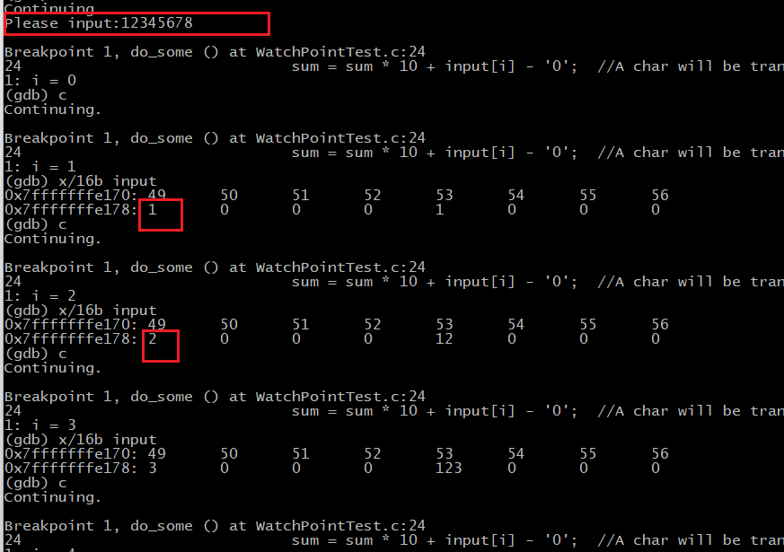
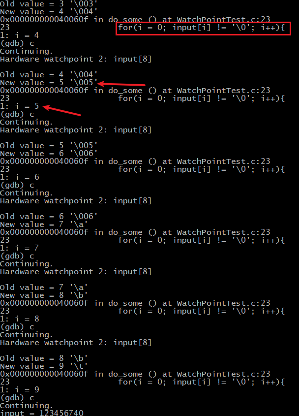

### 个人总结：

WatchPointTest.c 代码分析：

分析为什么输入超长数"12345678"到char数组``` char input[5]```中，却打印了“123456740”

**一，首先分析对于容量为[5]的数组，编译器如何分配空间，及在遍历的时候记录游标 i。**

```c
for (i = 0; input[i] != '\0'; i++)
```



1) 通过debug可知，如果用户定义数组量为[5]，那么编译器就会在紧邻的byte的第一位记录遍历时的游标 i，因为正常来说， char  input[5]中前四个时有效字符，最后一个是编译器给的"\0"(NULL)，

2) 但是个人输入了"12345678"，导致数组越界，默认给的终止符"\0"跑到下一个紧邻的下一个byte的头一个位置，而后遍历时，游标“i”又把这个终止符移到下一位了。

由此可推测这是导致本代码输出错误的原因。

**二，以下是设置watchpoint : watch input[8] 观察紧邻的下个byte的头一个位置数值的变化。**

1，首先进入函数，设置watchpoint : watch input[8] ，观察下标8位置的内容变化；

2，输入越界的数"12345678"后，执行continue观察变化，

可知即使在别的位置添加数，这个input[8]的存储的数值也改变，每次都和i的值一样，说明游标 i 的存储单元是紧跟在input数组后面的。在物理空间上，编译器是把他们紧挨着放着的。

**总结：**
最后input[8]的位置十进制是 8，但是```12345678 + x = 123456740  ```, 具体“8”是转换成什么值待研究！！

下图中 红色方框表示每次for执行的时候，input[8]的位置的值总是会改变。23表示代码的。

> 