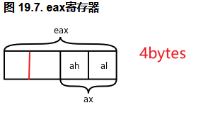

#### Analysis of Volatile

#### 1,  `%eax`



Each register is 4 bytes. `al` represents the least significant byte, `ah` represents the second least significant byte while `ax` represents the least significant two bytes.

For `%ecx` and `%edx`, the representation are `cl/ch/cx` and `dl/dh/dx`,  respectively.

#### 2, volatile

```c
volatile char c;
```

Variables which are modified by `volatile` are not to be optimize by compiler when execute `gcc -O test.c ` (the "O" is abbreviated from "optimise")

#### 3, analysis

```c
# include<stdio.h>

unsigned char recv;
unsigned char send;

unsigned char buffer[3];

int main (void) 
{
	buffer[0] = recv;
	buffer[1] = recv;
	buffer[2] = recv;
	send = ~ buffer[0];
	send = ~ buffer[1];
	send = ~ buffer[2];

	return 0;
}
```

**Note:** Definition of assembly commands: `movzbl` , see "Notes_on_Assembly.md"

3.1 The following `ojbdump -dS` file which was decompiled from an execute file that is generate by `gcc volatile_test.c` without `-O`  in the executed command.

```shell
int main (void) 
  4004ed:	55                   	push   %rbp
  4004ee:	48 89 e5             	mov    %rsp,%rbp

{
##############
# 1,The process is that CPU fetch data from the memory address of 'recv' and store the data into %eax, then fetch the low 8 bits of %eax and move it to '0x200b30'(the address of buffer[0] in memory)
  4004f1:	0f b6 05 35 0b 20 00 	movzbl 0x200b35(%rip),%eax        # 60102d <recv>
  4004f8:	88 05 30 0b 20 00    	mov    %al,0x200b30(%rip)        # 60102e <buffer>
	buffer[0] = recv; # the assembly instruction of this line is above.
# 2,	
  4004fe:	0f b6 05 28 0b 20 00 	movzbl 0x200b28(%rip),%eax        # 60102d <recv>
  400505:	88 05 24 0b 20 00    	mov    %al,0x200b24(%rip)        # 60102f <buffer+0x1>
	buffer[1] = recv;
# 3,  
  40050b:	0f b6 05 1b 0b 20 00 	movzbl 0x200b1b(%rip),%eax        # 60102d <recv>
  400512:	88 05 18 0b 20 00    	mov    %al,0x200b18(%rip)        # 601030 <__TMC_END__>
	buffer[2] = recv;
##################	
  400518:	0f b6 05 0f 0b 20 00 	movzbl 0x200b0f(%rip),%eax        # 60102e <buffer>
  40051f:	f7 d0                	not    %eax  # ~ buffer[0]
  400521:	88 05 0a 0b 20 00    	mov    %al,0x200b0a(%rip)   # send = ~buffer[0]     # 601031 <send>
	send = ~ buffer[0];
  400527:	0f b6 05 01 0b 20 00 	movzbl 0x200b01(%rip),%eax        # 60102f <buffer+0x1>
  40052e:	f7 d0                	not    %eax
  400530:	88 05 fb 0a 20 00    	mov    %al,0x200afb(%rip)        # 601031 <send>
	send = ~ buffer[1];
  400536:	0f b6 05 f3 0a 20 00 	movzbl 0x200af3(%rip),%eax        # 601030 <__TMC_END__>
  40053d:	f7 d0                	not    %eax
  40053f:	88 05 ec 0a 20 00    	mov    %al,0x200aec(%rip)        # 601031 <send>
	send = ~ buffer[2];
```

3.2  This was decompiled from one which was generated by `gcc -O votatile_test.c`. Namely, the executed file was optimized by compiler.

```shell
00000000004004ed <main>:
  4004ed:	0f b6 05 39 0b 20 00 	movzbl 0x200b39(%rip),%eax        # 60102d <recv>
 # After adding '-O' to the 'gcc', the CPU always fetch from `%eax`(register) and that is not what we expected. That can be avoided by add 'volatile' before the variables.
 4004f4:	88 05 34 0b 20 00    	mov    %al,0x200b34(%rip)        # 60102e <buffer>
  4004fa:	88 05 2f 0b 20 00    	mov    %al,0x200b2f(%rip)        # 60102f <buffer+0x1>
  400500:	88 05 2a 0b 20 00    	mov    %al,0x200b2a(%rip)        # 601030 <__TMC_END__>
  400506:	f7 d0                	not    %eax
  400508:	88 05 23 0b 20 00    	mov    %al,0x200b23(%rip)        # 601031 <send>
  40050e:	b8 00 00 00 00       	mov    $0x0,%eax
  400513:	c3                   	retq   
  400514:	66 2e 0f 1f 84 00 00 	nopw   %cs:0x0(%rax,%rax,1)
  40051b:	00 00 00 
  40051e:	66 90                	xchg   %ax,%ax
```

The result in Figure 3.2 come from the source code in which all the variables are note modified by `volatile` so that the CPU will fetch form a register-it is `%eax`'s `al` here  when  -O is added in the  `gcc -O`

3.3  After adding `volatile` before the variables in the source code.

```c
volatile unsigned char recv;
volatile  unsigned char send;
```

The assembler mnemonics.

`cl` is the low 8 bits of `%ecx`.

```shell
00000000004004ed <main>:
  4004ed:	0f b6 0d 39 0b 20 00 	movzbl 0x200b39(%rip),%ecx        # 60102d <recv>
  4004f4:	88 0d 34 0b 20 00    	mov    %cl,0x200b34(%rip)        # 60102e <buffer>
  4004fa:	0f b6 15 2c 0b 20 00 	movzbl 0x200b2c(%rip),%edx        # 60102d <recv>
  400501:	88 15 28 0b 20 00    	mov    %dl,0x200b28(%rip)        # 60102f <buffer+0x1>
  400507:	0f b6 05 1f 0b 20 00 	movzbl 0x200b1f(%rip),%eax        # 60102d <recv>
  40050e:	88 05 1c 0b 20 00    	mov    %al,0x200b1c(%rip)        # 601030 <__TMC_END__>
  400514:	f7 d1                	not    %ecx
  400516:	88 0d 15 0b 20 00    	mov    %cl,0x200b15(%rip)        # 601031 <send>
  40051c:	f7 d2                	not    %edx
  40051e:	88 15 0d 0b 20 00    	mov    %dl,0x200b0d(%rip)        # 601031 <send>
  400524:	f7 d0                	not    %eax
  400526:	88 05 05 0b 20 00    	mov    %al,0x200b05(%rip)        # 601031 <send>
  40052c:	b8 00 00 00 00       	mov    $0x0,%eax
  400531:	c3                   	retq   
  400532:	66 2e 0f 1f 84 00 00 	nopw   %cs:0x0(%rax,%rax,1)
  400539:	00 00 00 
  40053c:	0f 1f 40 00          	nopl   0x0(%rax)
```

The above instructions are different from what we see in 3.2.  The CPU didn't always fetch data from `%eax` (Here are`%ecx` and `%edx`) again. The  `volatile` works.

#### 4, To learn more about cache.

[Chapter 19.6](https://akaedu.github.io/book/ch19s06.html)

