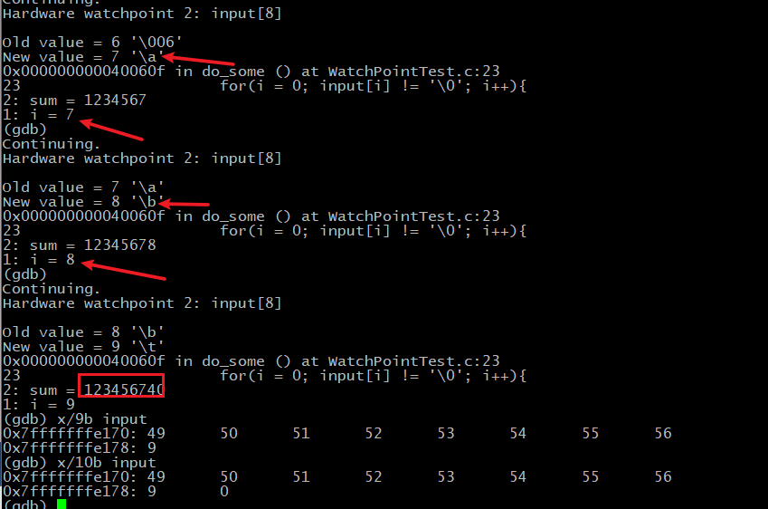

### 1, gcc常用命令

gcc  Hello.c : 编译Hello.c，默认输出a.out
gcc  Test.c  -o  Test : Linux环境下指定生成名称为Test的文件，无后缀。Windows下生成Test.exe(Linux下无后缀,无影响)

2, 执行编译的文件
./Hello  : Linux
Hello.exe : Windows2,执行编译的文件

3, 打印报警信息，报警信息不是报错，但建议每次都使用，可使程序更健壮。
gcc -Wall Hello.c -o Hello

4, C99语法加编译选项
  gcc -std=c99 ForTest.c -o ForTest.out

### 2, gdb的debug步骤

具体参照[LinuxC](./C语言资料/Linux C编程一站式学习.pdf) 章节10.1

#### 1, 生成可调试文件：

```shell
gcc -g GDB_Test.c -o test.out
```

注意：-g 选项的作用是在可执行文件中加入源码的信息，并非把源码文件全部嵌入到编译后的可执行文件里，所以生成之后，源码的名字和位置都不要动了，否则找不到。

#### 2,  gdb命令

##### 1) 使用gdb命令执行可调试文件

```shell
gdb test.out
```

然后CLI界面会出现gdb的命令界面：

##### 2) help命令

```shell
$ gdb test.out
GNU gdb 6.8-debian
Copyright (C) 2008 Free Software Foundation, Inc.
License GPLv3+: GNU GPL version 3 or later <http://gnu.org/licenses/gpl.html>
This is free software: you are free to change and redistribute it.
There is NO WARRANTY, to the extent permitted by law.  Type "show copying"
and "show warranty" for details.
This GDB was configured as "i486-linux-gnu"...
(gdb)   # 这里可以输入相关命令
(gdb) help # 查看帮助文件
(gdb) help files  # 查看files命令帮助
```

（gdb） \<Enter\>  指重复上一条的命令。

##### 3) 查看源码：

```shell
(gdb) list 1 / list # 从第一行列出源码，或者不写1，一次默认列出10行（不包括注释），
(gdb) list  # 继续输入list，再回车则展示下面的10行
(gdb) <Enter> # 或者什么都不输直接Enter回车，默认展示后10行
```

如果修改源码的名字或者位置，再执行list命令就会报：No such file or directory 错误。

##### 4)  退出调试：

```shell
(gdb) quit
```

##### 5) 开始执行程序：

```shell
gdb test.out # 退出后需要重新启动
(gdb) start # 开始执行
(gdb) next / n / Enter # 执行下一行，或直接按回车Enter也可以，每次执行一步
```

**5.1 重新执行程序**

```shell
(gdb) run # 执行了部分程序后，从开头重新执行程序
```

##### 6) 进入某个函数

```shell
# 当执行到某个函数时可使用如下命令进入函数
(gdb) step / s # 进入函数
```

###### 	 6.4.1 进入之后可查看栈帧：

```shell
(gdb) backtrace / b   # 查看栈帧
```

######       6.4.2 可看到如下信息：

```shell
(gdb) backtrace
#0  add_range (begin=1, end=10) at GDB_Test.c:12
#1  0x000000000040056d in main () at GDB_Test.c:23
- 说明：add_range(..)是被main()函数调用的，传进的参数是：begin=1, end=10
```

######       6.4.3可以使用命令查看当前栈帧局部变量的值：

```shell
(gdb) info / i  locals  # 查看局部变量的值
```

######      6.4.4 也可以调出 #1号栈帧，进行查看

```shell
(gdb) frame /f 1  # 调出一号栈帧
(gdb) info / i locals  # 进行查看
```

######     6.4.5 从当前函数返回，

本例中是返回了调用函数main，在 main里接着向下执行了。

```shell
(gdb) finish  # 从当前函数返回	
```

##### 7)  显示，改变某局部变量

例如上面可以看到由于sum没有初始化导致的错误，可以在step进入add_range()函数后，设置sum=0，来继续往下走验证结果是否正确。

```shell
(gdb) step # 首先进入add_range(..)函数
(gdb) set var sum=0  # 改变变量的值，继续往下走
(gdb) next / n # 继续往下走
```

也可以使用print / p 来修改变量的值，print还可以调用函数。

```shell
(gdb) print / p sum  #显示变量的值
(gdb) print / p result[2] = 25  # 随意修改当前栈帧的变量
# 修改后会把值存储在一个编号序号的临时变量里如 $5 25
# 也可以调用函数，实际这里可以随意写个已有的函数如printf(..)
(gdb) print / p printf("%d\n",result[2])
$ 6 4  # 这里接受的是printf(..)函数的返回值。返回值就是其打印的字符数。
```

##### 8)  始终展示局部变量的值

进入函数后才能使用此命令，否则找不到该局部变量。

```shell
(gdb) display sum  # 每次程序走一步就显示当前sum的值。可展示多个，执行多次命令即可。
(gdb) display sum2 # ...

(gdb) undisplay sum # 取消展示
```

##### 9) 断点调试相关

- 设置断点 ，查看，删除，禁用断点

  首先得使用 ```(gdb) list 1```命令查看代码，选好行号。

```shell
(gdb) break / b 15  # 在15行设置断点,程序每次走到这里就会停

(gdb) info / i breakpoints  # 查看断点，执行后会有一个列表展示出来，注意观察相关信息

(gdb) disable breakpoints 1 # 禁用1号断点
(gdb) enable breakpoints 3 # 启用3号断点

(gdb) delete breakpoints 5 # 删除指定号码的断点
(gdb) delete breakpoints  # 不指定号码则删除所有断点
```

- 连续运行，不是一步步走，而是走到断点才停

```shell
(gdb) continue / c  # 连续运行
```

- 指定条件激活断点

```shell
(gdb) break 15 if sum != 0  # 当sum != 0时才打断
```

**10) 设置观察点**

观察点是是指当程序访问某一个存储单元时中断。跟断点作用相同，只是触发机制不同。
一般有观察点则不设置其它断点，防止干扰，也可以需要根据实际情况两者都设置。

```shell
(gdb) watch input[8]  # 设置当input[8]对应的存储空间变化时则暂停
					  # 设置好后，输入：(gdb)continute 执行
(gdb) info watchpoints #查看观察点 
```

**个人总结：**
通过WatchPointTest.c 的调试，可知即使在别的位置添加数，这个input[8]的存储的数值也改变，每次都和i的值一样，说明 i 的存储单元是紧跟在input数组后面的。在物理空间上，编译器是把他们紧挨着放着的。

个人模拟输入:12345678会得到 123456740，推测是根据代码中的公式```sum = sum*10 + input[i] - '0';```，算出来的。



#### 3， gdb调试scanf(...)

scanf(...)仍然可以接收参数

```shell
(gdb) n   # 这里执行下一步的scanf()
123       #这里既可以输入参数
```

