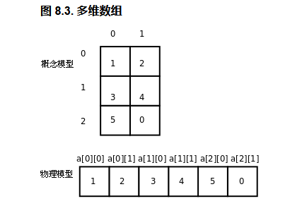
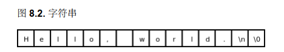
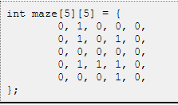
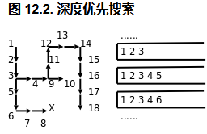
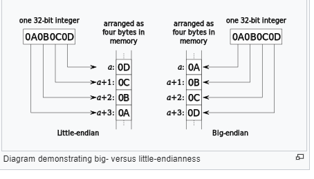

#### 1，Widows下配置gcc环境

配置mingw即可，详情参照mingw配置教程

#### 2，include含义

```txt
程序第一行的#号（Pound Sign，Number Sign或Hash Sign）和include表示包含一个头文件（Header File），后面尖括号（Angel Bracket）中就是文件名（这些头文件通常位于/usr/include目录下）。头文件中声明了我们程序中使用的库函数，根据先声明后使用的原则，要使用printf函数必须包含stdio.h，要使用数学函数必须包含math.h，如果什么库函数都不使用就不必包含任何头文件，例如写一个程序int main(void){int a;a=2;return 0;}，不需要包含头文件就可以编译通过，当然这个程序什么也做不了。

注意：使用math.h中声明的库函数还有一点特殊之处，gcc命令行必须加-lm选项，
因为数学函数位于libm.so库文件中（这些库文件通常位于/lib目录下），-lm选项告诉编译器，我们程序中用到的数学函数要到这个库文件里找。本书用到的大部分库函数（例如printf）位于libc.so库文件中，使用libc.so中的库函数在编译时不需要加-lc选项，当然加了也不算错，因为这个选项是gcc的默认选项。关于头文件和库函数目前理解这么多就可以了
```

**注意：**
printf()函数在libc.so中，使用libc.so需要加`-lc`，但是gcc默认加，因为几乎每个程序都要用它，所以个人编译时不加不报错。

#### 3，使用math.h库时注意

后面要加 -lm，否则编译不通过。

```shell
 gcc -Wall RoundNumber.c -o RoundNumber.out -lm
```

#### 4，程序由五种基本指令组成

程序由一系列指令（Instruction）组成，指令是指示计算机做某种运算的命令，通常包括以下几类：

- 输入（Input）

  从键盘、文件或者其它设备获取数据。

- 输出（Output）

  把数据显示到屏幕，或者存入一个文件，或者发送到其它设备。

- 基本运算

  执行最基本的数学运算（加减乘除）和数据存取。

- 测试和分支

  测试某个条件，然后根据不同的测试结果执行不同的后续指令。

- 循环

  重复执行一系列操作。

#### 5，递归和循环

实际所有的循环都可以用递归来代替，递归是计算机的精髓所在，也是编程的精髓所在。

#### 6，数学函数和编程语言函数的区别

数学函数根据已知的数计算出一个结果，没有Side Effect(副作用)。

编程语言函数除了根据输入参数，计算之后得到一个结果——返回值，还有Side Effect，指函数中可能有printf(..)语句打印结果，或则改变了变量的值等。

因此编程分为“函数式编程(Functional programming)”和“命令式编程(Imperative programming)”。
C语言属于命令式编程。Java也是。C++估计也是。

#### 7，左值与右值

int  a = b + 1;

等号左边的 “a” 表示一个存储位置而不是一个值，称作左值(left value)，在程序中如果写作 a + 1 = b 是错误的，而右边的表达式表示的是一个值，需放在右边因此称为右值（right value），目前表达式中有变量可以做左值，还有其它的表达式也可以做左值。

参考《Linux C一站式编程》5. 表达式

#### 8，a +++++ b怎么运算

编译器编译时会逐个字符判断，取最长的合法字符。先判断a+符合语法，然后a++也符合，a+++不符合，最后取a++。同理a++取完之后，再取a++  ++，最后留一个 +b。即a++  ++  +b。

但是当编译器开始语义分析时会报错，因为++要求其变量既可以做左值，a++中a可以做左值，但是a++ ++中“a++”不可以做左值。

#### 9，continue在for和while中使用时的不同

参考：https://blog.csdn.net/o707191418/article/details/81221168

for循环中的i++会执行，而while循环中的i++不会执行。参考个人代码ContinueInForAndWhile.c

#### 10，%lf和%f在printf()和scanf()中的区别

 %f: 表示单浮点精度float
 %lf: 表示双浮点精度double

1,printf()函数中这俩没有区别，因为printf()会自动把单浮点数float向上转型为double
2,scanf()函数中有区别，%f表示收float, %lf表示接收double.

#### 11，Array :数组

##### 1) C编译器不检查越界的原因

以下引自教程

C编译器并不检查count[-1]或是count[100]这样的访问越界错误，编译时能顺利通过，所以属于运行时错误

你可能会想为什么编译器对这么明显的错误都视而不见？理由一，这种错误并不总是显而易见的，在第 1 节 “指针的基本概念”会讲到通过指针而不是数组名来访问数组的情况，指针指向数组中的什么位置只有运行时才知道，编译时无法检查是否越界，而运行时每次访问数组元素都检查越界会严重影响性能，所以干脆不检查了；

理由二，[C99 Rationale]指出C语言的设计精神是：相信每个C程序员都是高手，不要阻止程序员去干他们需要干的事，高手们使用count[-1]这种技巧其实并不少见，不应该当作错误。

##### 2) 多维数组

2.1  多维数组的存储方式：

以 int\[3\]\[2\] = { {1,2},{3,4},{5,}} 或者 {1,2,3,4,5};  //最后一个未赋值默认给0



概念模型只是为方便理解人们想象出的一种示意图，实际在C语言里这种概念模型称为Row major; 

物理层中在存储器这6个元素是连续存储的，像一维数组一样。

#### 12，C语言的预处理，以及define，Macro宏等的含义

C语言的编译过程实际分为预处理和编译两个阶段。

**Preprocess : 预处理**

首先编译器把代码进行预处理，预处理所做的是把引入的库的代码展开，例如，# include\<stdio.h\>等，对# define定义的变量统一赋值等。预处理之后才进行真正的编译操作。

查看预处理后的数据的命令

```shell
gcc -E Hello.c : 后面什么都不要加，因为还没开始编译
cpp Hello.c : 作用相同
```

下面的代码就是表示指示编译器进行预处理。

**define**

\# define表示指示编译器在预处理阶段把代码中所有N都替换为20，注意这种定义全局变量的方式跟枚举还不一样，枚举enum是在编译阶段给其变量赋值的。

 `define`不仅用于定义常量，也可以定义更复杂的语法结构，称为宏（Macro）定义 

```c
# include <stdio.h>
# include <stdlib.h>
# define N 20
```

**其它:** 

define, include实际并不是C语言的关键字，只是这里写在文件头部，前面加上\# 表示特殊含义。实际代码中也可以使用这两个单词作为标识符。

参照： [Linux C编程一站式学习](./C语言资料/Linux C编程一站式学习.pdf)   ->2. 数组应用实例：统计随机数

#### 13, C99新for语法

这是从C++ 借鉴过来的，gcc命令编译时最后要加上 : " -std=c99"

```c
for(int i = 0; i <= n; i++){...}
```

####  14, 字符串String类型

1，在C语言中没有String这个关键字，字符串是以char[]的形式表示的；

2，例如“Hello, world.\n”在底层是这样的：



最后的\0是八进制，十进制也是0，即在ASCII的0~127范围内，用数字"0"字符"Null"，这是一个非显示字符，打印不出来。用这个字符代表一个字符串的结束。
参照[ASCII Table](.\C语言资料\ASCII-Table.jpg)

#### 15, 深度优先，广度优先

第 12 章 栈与队列 (3. 深度优先搜索 ) 迷宫回溯思路分析

 

：

**深度优先的方法：**

**1) 什么是深度优先？**

以迷宫回溯为例，在探索路线的时候如果先发现有一条路走的通，就一直走下去，直到走不通为止。就是先达到一定深度，走不通了就弹栈。这就是深度优先。

**2) 具体思路**：

如下面走到(4, 2)第8步走不通了，就一直弹，弹到第4步后发现可以向右走，就继续往下走，直到终点。

由此可知，只有栈的后进先出的特性才使得这种做法可以实现。

```txt
2 1 0 0 0 
2 1 0 1 0 
2 2 0 0 0  坐标(2,1)
2 1 1 1 0 
2 2 2 1 0  坐标(4,2)
```

本案例中老师使用是栈的方式实现，而不是Java数据结构中所使用的递归。实际道理相同，递归也是使用的栈LIFO的特性。

#### 16,  浮点数

以下摘自[Linux C编程一站式学习](./C语言资料/Linux C编程一站式学习.pdf)   -> 14.4 浮点数

如果要表示17这个数，我们知道17=17.0×100=0.17×102，类似地，17=(10001)2×20=(0.10001)2×25，把尾数的有效数字全部移到小数点后，这样就可以表示为：

**图 14.7. 17的浮点数表示**


为什么0.10001放到后面singficand位置多了3个0 ？

因为singficand位置是放小数点后面的数的，是左对齐的。后面位数自动补0。

#### 17, 数据类型

##### 1) 整数类型

- char : C中只占1个byte，Java中占2个byte；

- 其它整数类：  除了`char`型在C标准中明确规定占一个字节之外，其它整型占几个字节都是Implementation Defined。通常   的编译器实现遵守ILP32或LP64规范，如下表所示；

- 字符常量，枚举常量实质都是int类型。

**表 15.1. ILP32和LP64**

| 类型      | ILP32（位数） | LP64（位数） |
| --------- | ------------- | ------------ |
| char      | 8             | 8            |
| short     | 16            | 16           |
| int       | 32            | 32           |
| long      | 32            | 64           |
| long long | 64            | 64           |
| 指针      | 32            | 64           |

##### 2) 浮点类型

```txt
C标准规定的浮点型有float、double、long double，和整型一样，既没有规定每种类型占多少字节，也没有规定采用哪种表示形式。浮点数的实现在各种平台上差异很大，有的处理器有浮点运算单元（FPU，Floating Point Unit），称为硬浮点（Hard-float）实现；有的处理器没有浮点运算单元，只能做整数运算，需要用整数运算来模拟浮点运算，称为软浮点（Soft-float）实现。大部分平台的浮点数实现遵循IEEE 754，float型通常是32位，double型通常是64位。
```


**数据类型的无符号和有符号的分别指什么？什么区别？**

以char为例，无符号指char范围内的所有数都表示正数，有符号指按照一定规定用一部分数表示负数。

#### 18, 位运算 Bitwise

**什么是位运算？**

位运算是针对二进制数字的位bit进行操作，计算机底层处理位运算比算术运算速度要快。

移位运算：根据二进制的特性，左移一位相当于乘以2，右移一位相当于除以2。
例如: 11(3) >>1 = 110(6)， i * 8 可以写成 i >> 3，后者运算速度要快。

**注意事项：**

- 正数移位的时候，右移后高位补0。例：```0b1100 >> 2 = 0b0011```

- 负数移位是Inplementation Defined，即由不同编译平台来决定，一般是先忽略符号，再移动，这样得到的结果也是每移动一位是2的倍数。

- 注意：同时需要注意二进制数中有一个位是符号位的问题，位运算时编译器不管是不是符号位，都是直接移动。跟做算数运算的时候不一样。

**位运算原数值正负符号问题分析：**

结合个人代码BitwiseTest.c中注释 理解

```c
int main () {
    int i = 0xcffffff3; // 
    printf("%x\n", 0xcffffff3>>2);  //0xCFFFFFF3= 0b11001111111111111111111111110011
    printf("%x\n", i>>2);
}
```

参考：

[符号数移位问题](./note-images/bitwise-unsigned-signed.md)

 https://stackoverflow.com/questions/43389598/how-to-explain-the-bit-right-shift-two-different-results

#### 19, +=和+运算的区别

a += 1(或a++ / ++a  )这个表达式a只求值一次，而  a = a + 1中a求值两次，对于简单的的算式来说没有区别，如果计算量比较大的话使用前者比较合适。

参照: [Linux C编程一站式学习](./C语言资料/Linux C编程一站式学习.pdf) :  第 16 章 运算符详解 , 2. 其它运算符 

#### 20, ELF文件

[Linux C编程一站式学习](./C语言资料/Linux C编程一站式学习.pdf) ：18.5

ELF文件格式是一个开放标准，各种UNIX系统的可执行文件都采用ELF格式，它有三种不同的类型：

- 可重定位的目标文件（Relocatable，或者Object File）
- 可执行文件（Executable）
- 共享库（Shared Object，或者Shared Library）

#### 21, 汇编寄存器含义

Unix中汇编使用的是AT&T的语法，还有 intel语法。

register:  寄存器

```txt
x86的通用寄存器有eax、ebx、ecx、edx、edi、esi。这些寄存器在大多数指令中是可以任意选用的，比如movl指令可以把一个立即数传送到eax中，也可传送到ebx中。但也有一些指令规定只能用其中某个寄存器做某种用途，例如除法指令idivl要求被除数在eax寄存器中，edx寄存器必须是0，而除数可以在任意寄存器中，计算结果的商数保存在eax寄存器中（覆盖原来的被除数），余数保存在edx寄存器中。也就是说，通用寄存器对于某些特殊指令来说也不是通用的。

(AT&T语法下)x86的特殊寄存器有ebp、esp、eip、eflags。eip是程序计数器，eflags保存着计算过程中产生的标志位，其中包括第 3 节 “整数的加减运算”讲过的进位标志、溢出标志、零标志和负数标志，在intel的手册中这几个标志位分别称为CF、OF、ZF、SF。ebp和esp用于维护函数调用的栈帧，在第 1 节 “函数调用”详细讨论。
```

#### 22, 函数调用分析

**Chapter 19.1**

**预备知识：**

1)，系统为底层的一个byte分配一个地址；

2)，x/20 $esp打印结果分析；

```shell
(gdb) x/20 $esp
0xbff1c3f4:	0x00000000	0xbff1c6f7	0xb7efbdae	0x00000005
0xbff1c404:	0xbff1c414	0x080483c2	0x00000002	0x00000003
0xbff1c414:	0xbff1c428	0x080483e9	0x00000002	0x00000003
0xbff1c424:	0xbff1c440	0xbff1c498	0xb7ea3685	0x08048410
0xbff1c434:	0x080482e0	0xbff1c498	0xb7ea3685	0x00000001
# 这个是教材中的结果，个人打印出来的是十进制，可能跟编译器有关。
```

为什么地址十位数递增1，和打印的数的关系？

- 打印的数是8位的16进制，每两位是一个byte，因此一个数代表4个byte，每行16个byte；
  	  例：```0xf1 = 0b1111 0001(1byte)```
-  十六进制(Hexdecimal)的十位数上一个代表16，因此有16个地址，正好对应每行的16个byte。
-  由此可知`%esp`寄存器中一个地址对应一个byte，而每次push, pop`%esp`以4个地址为单位移动，有的系统中以8个地址单位移动，分别对应的是32位，64位的系统。结合下面3.2理解。

**3),  Stack(栈) 相关知识：**

1. 栈的本质是什么？
   栈实际是一种抽象的概念，表示使用数据结构，物理意义上是保存在`%esp`寄存器里一串连续的内存地址，指向物理存储空间里一块连续的地方。通过push, pop操作使`%esp`中的值依次变化达到入栈，弹栈的效果。

2.  **`%esp`寄存器总是指向栈顶**，在x86平台上这个栈是从高地址向低地址增长的，每次压栈push的时候esp的地址就减4，弹栈pop就加4；（x64平台上是每次移动8）
   `%ebp`总是指向栈底，即`%ebp`的值一直是保存的编号是栈底的，如果使用栈其它位置的数据时用例如`-0x4(%ebp)`, `-0x8(%esp)`等相对位置的数来表示；
pop  %ebp / %rbp的时候，ebp或rbp就弹栈，即根据不同平台执行+4或+8。
   
3. 实际栈本身也是一个存储空间，它的地址是连续的，入栈push时地址由高到低增长，出栈pop时地址由低到高。栈里的物理地址， 例如以这个地址`0xbff1c3f4`开始对应一块物理存储空间A，而A里存的才是真正要用的程序中的指令，数据信息等的内存地址。

4. **栈帧(stack frame) 是什么？**
   
   栈帧和寄存器不一样。栈帧是过程活动记录，存储出栈入栈的顺序，栈帧就是利用`%ebp`的偏移(注意：不是`%esp`)来执行相关访问物理内存地址，进行下一步操作的。 
   

参考：<a href="https://zhuanlan.zhihu.com/p/77663680">栈和栈帧</a>
   每个函数被调用时都会被分配一个独立的栈帧，即每次调用一个子函数系统都会分配一个独立的栈帧，和父函数的栈帧不一样。`%esp`同时会指向子函数的新的栈顶。每个函数都有各自对应`%edp`值，父函数子函数之间这个值有联系(待研究)。

4)  %esp`等是x86平台的代号，`%rsp`等是x64平台的代号

**具体步骤分析:**

一， 从 main函数开始分析，上面是本人打印的，下面是老师打印的，可对比分析。根据本章节老师讲解，结合反编译结果分析，老师的讲解感觉有误，后期待分析！

1. 调用函数foo(2, 3)时，3先保存进%esp, 然后2在保存到0x4%esp，由此可知函数是由左向右一次压栈的。
   [附录：个人反编译结果](./note-images/objdump result.txt)
   
   [附录：老师反编译结果(在源目录打开，这里打开内容窜行)](./note-images/teacher's objdump.txt)
   
2. 根据反编译结果可知，首先main方法被push入栈，此时`%ebp`和`%esp`的初始值相同，然后`%esp`的值递增，把声明的局部变量入栈。

3. 备注：%eax用来存储运算的结果，同时也存返回值。

   

#### 23, main函数和_start分析

Chapter 19.2 

1. 汇编文件Test.s，使用 `as` 生成Test.o后，如果用`gcc Test.o`链接的话会报错，原因是gcc命令会调用crt1.o文件来拼接最终的可执行程序，然而Test.s中已经定义了"_start"了。
   查看crt1.o, crti.o文件：

   ```shell
   nm /usr/lib64/crt1.o  # (64位系统目录)，注意名称中的是数字`1`不是字母`l`，
   ```

2. C语言代码，使用gcc -v可查看编译信息，其中包含链接了哪些文件。

#### 24, 修饰变量关键字

const, static, register

#### 25, ELF文件

参考：https://www.baeldung.com/linux/executable-and-linkable-format-file

相关概念：

1. little endian: 小端计数 和 big endian: 大端计数。这两种指的是计算机底层读数的方式，以byte类型为例0000 0001按小端计数就是1，即右边的数最小，如果按大端就是128。
   为什么这样规定？
   因为本质上不同的数据实际就是二级制的1，0的顺序不同，数据传递也是按顺序一个1一个0的挨个传递。因此需要规定好读取规则，否则容易造成数据错误。



分析：

初步理解：

ELF是一种Unix中规定好的文件格式，存储在硬盘上，当系统读取它的时候按照规则逐步执行其中的编码。

